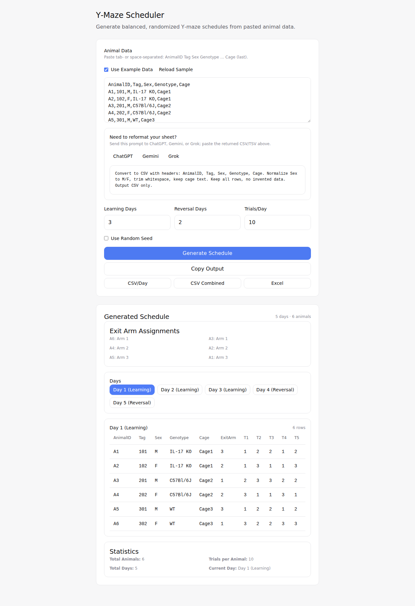

# Y-maze Randomizer

This project provides a Tkinter-based GUI for generating randomized Y-maze schedules. It balances exit arm assignments across animals and produces per-day tables that minimize color switches between trials.

## Features
- Balanced exit-arm assignment within genotype, sex, and cage groups, while keeping global counts for arms 1–3 as even as possible.
- Dynamic programming to build trial schedules that avoid the learning-day exit arm for each animal and minimize arm switching.
- Paste or type animal data directly into the interface; robust parser expects rows of `AnimalID Tag Sex Genotype Cage`.
- Export generated schedules as separate CSV files, a combined CSV, or an Excel workbook with one sheet per day.

## Screenshot

Example run using the built-in sample dataset and default parameters in the modern web app:



## Requirements
- Python 3 with Tkinter (included with most Python distributions).
- Optional: `openpyxl` for Excel export (`pip install openpyxl`).

## Usage
1. Run the application:
   ```bash
   python code.py
   ```
2. Enter animal information into the text box. Each line should contain:
   ```
   AnimalID Tag Sex Genotype Cage
   ```
   The parser uses the `Sex` token to separate fields, so tags and genotypes may contain spaces.
3. Specify the number of learning days, reversal days, and trials per day.
4. Click **Generate** to produce the schedules.
5. Copy results to the clipboard or use the export buttons for CSV or Excel files.

## Example Input

An example input sheet is available at [`examples/example_input.csv`](examples/example_input.csv),
which demonstrates the expected column layout:

```
AnimalID,Tag,Sex,Genotype,Cage
A1,101,M,IL-17 KO,Cage1
A2,102,F,IL-17 KO,Cage1
A3,201,M,C57Bl/6J,Cage2
A4,202,F,C57Bl/6J,Cage2
```

For illustration, a generated day-1 schedule for these animals might look like:

```
AnimalID,Day1ExitArm
A1,1
A2,2
A3,3
A4,1
```

Actual schedules may vary depending on the random seed and parameter choices.

## Notes
- Exit arm assignments are deterministic for a given random seed; leave the seed blank for a fresh randomization each run.
- Excel export requires `openpyxl`; a warning is shown if the library is missing.

## Contributing
Pull requests are welcome! Please open an issue to discuss major changes before submitting.
